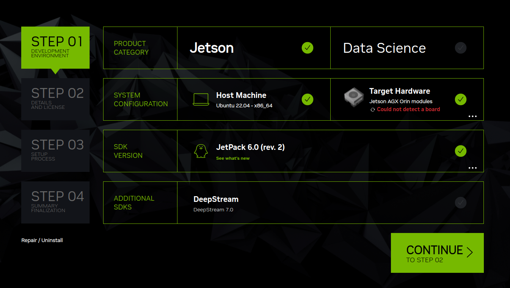

# Orin

Instructions to set up PyTorch and Yolo on Jetson Orin AGX.

## Jetpack

To install official Nvidia sdk for Jetsons, Jetpack, you need an ubuntu 20 station. Then go ahead and install Nvidia SDK manager.

  

    
    <!--
    
    -->
  

## Docker Installation

## Docker Image

## Deep Learning
